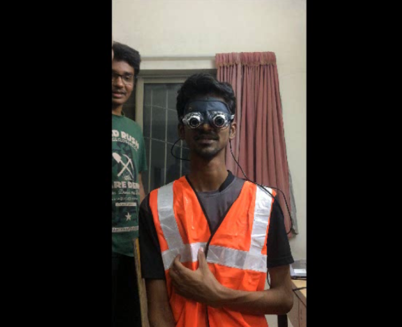
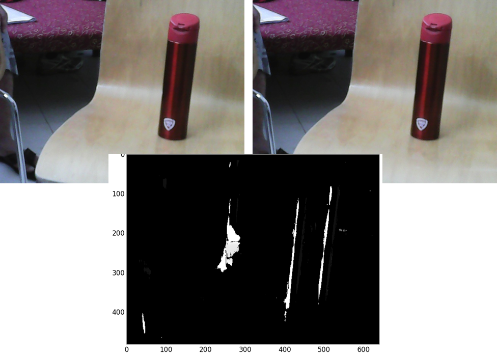

# Haptic-Feedback-Obstacle-Detector
This project aims at providing support for a visually impaired by notifying them of obstacles above waist level using vibration motors fitted in vest.

## Technologies used
Raspberry pi, Linux, OpenCV, Python

## Screens

